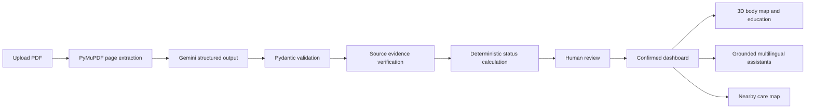
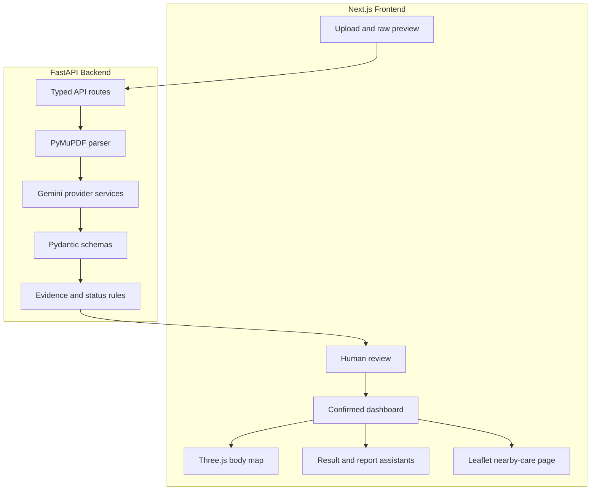

# Clarity Health AI

Clarity Health is an AI-assisted prototype that transforms text-based laboratory PDFs into reviewed, understandable health-report dashboards. It combines deterministic document processing with schema-constrained Gemini extraction, human verification, educational visualization, multilingual assistance, and nearby-care discovery.

> **Educational prototype:** Clarity Health does not diagnose conditions, prescribe treatment, determine urgency, or replace a qualified healthcare professional. Use synthetic or properly de-identified reports only.

## Highlights

- Upload and validate text-based PDF reports up to 10 MB
- Preserve page-level text for traceable source evidence
- Extract structured laboratory results with Gemini and Pydantic
- Reject fabricated source excerpts and wrong-page citations
- Calculate high, low, normal, and unknown status with deterministic code
- Require users to confirm or exclude every AI-extracted result
- Visualize confirmed values against their printed reference intervals
- Explore a synchronized, animated 3D educational body map
- Read local plain-language explanations and educational illustrations
- Ask result-specific or whole-report questions grounded in confirmed data
- Use English, Spanish, Arabic with RTL layout, or Telugu
- Open deterministic PubMed and MedlinePlus reference links
- Discover nearby clinics and hospitals with OpenStreetMap

## How It Works



The LLM is used only where language understanding is useful. File validation, reference-range comparisons, health-rating calculations, user confirmation, citation checks, research URLs, and map queries remain deterministic application logic.

## Architecture



## Technology Stack

| Layer | Technology | Responsibility |
|---|---|---|
| Frontend | Next.js, React, TypeScript | Application routes, workflow state, responsive UI |
| Styling | Tailwind CSS | Layout, visual system, responsive behavior |
| API | FastAPI, Uvicorn | Typed HTTP endpoints and server runtime |
| Validation | Pydantic | Runtime contracts and Gemini response schemas |
| PDF processing | PyMuPDF | Native page-level text extraction |
| AI | Google Gemini via `google-genai` | Structured extraction, questions, translation |
| 3D | Three.js, React Three Fiber, Drei | Interactive body map and highlights |
| Mapping | Leaflet, React Leaflet, OpenStreetMap | Nearby-care map and facility markers |
| References | PubMed, MedlinePlus | Deterministic research and patient-information links |
| Testing | Pytest, ESLint, Next.js build | Backend behavior and frontend quality gates |

## Safety and Grounding

Clarity Health treats AI output as untrusted until it passes multiple controls:

1. Gemini must return data matching a strict schema.
2. Missing report fields remain `null`; they are never inferred.
3. Every result includes a source page and exact source excerpt.
4. The backend verifies that the excerpt exists on the claimed page.
5. Python, not the LLM, compares numeric values with reference boundaries.
6. Every result must be confirmed or excluded by the user.
7. Assistants accept confirmed results only.
8. Whole-report citations must match test names in the submitted dataset.
9. PubMed and MedlinePlus URLs are generated by application code, not Gemini.

The displayed **health rating** is a transparent reference-range alignment summary, not a clinically validated health score.

## Project Structure

```text
Clarity-Health-AI/
├── backend/
│   ├── app/                    # FastAPI routes, schemas, PDF and AI services
│   ├── tests/                  # Backend behavior and safety tests
│   ├── .env.example            # Safe environment template
│   └── requirements.txt
├── frontend/
│   ├── public/medical/         # Generated educational illustrations
│   └── src/
│       ├── app/                # Main and nearby-care routes
│       ├── components/         # Upload, review, dashboard, chat, map, 3D UI
│       ├── lib/                # API client, education, anatomy, language logic
│       └── types/              # Frontend data contracts
├── docs/                       # Interview guide and cheat sheet
├── samples/                    # Synthetic demonstration report
├── scripts/                    # Reproducible sample/image generators
└── README.md
```

## Prerequisites

- Node.js 20 or newer
- npm 10 or newer
- Python 3.10 or newer
- A Gemini API key from [Google AI Studio](https://aistudio.google.com/apikey)

## Local Setup

### 1. Clone the repository

```powershell
git clone https://github.com/Abdul-Zahid01/Clarity-Health-AI.git
Set-Location Clarity-Health-AI
```

### 2. Configure the backend

```powershell
Set-Location backend
python -m venv .venv
.\.venv\Scripts\Activate.ps1
python -m pip install -r requirements.txt
Copy-Item .env.example .env
```

Edit `backend/.env` locally:

```text
GEMINI_API_KEY=your-api-key-here
GEMINI_MODEL=gemini-3.1-flash-lite
```

Never commit or share `backend/.env`.

Start FastAPI:

```powershell
uvicorn app.main:app --reload --port 8000
```

### 3. Configure the frontend

Open a second terminal from the repository root:

```powershell
Set-Location frontend
npm install
npm run dev
```

Open:

- Application: <http://localhost:3000>
- FastAPI documentation: <http://localhost:8000/docs>

The frontend defaults to `http://localhost:8000`. Override it by copying `frontend/.env.example` to `frontend/.env.local` and changing `NEXT_PUBLIC_API_URL`.

### macOS and Linux backend activation

```bash
cd backend
python3 -m venv .venv
source .venv/bin/activate
python -m pip install -r requirements.txt
cp .env.example .env
uvicorn app.main:app --reload --port 8000
```

## Demo Workflow

1. Upload [`samples/synthetic-blood-report.pdf`](samples/synthetic-blood-report.pdf).
2. Inspect the raw page-level extraction.
3. Confirm that the report is synthetic or properly de-identified.
4. Create the AI-assisted review table.
5. Correct, confirm, or exclude extracted results.
6. Finalize review to open the confirmed dashboard.
7. Select result cards to update the 3D body map.
8. Open **Learn & ask** for education and result-specific chat.
9. Open **Ask report** for cross-result questions.
10. Switch languages or open **Nearby care**.

## API Endpoints

| Method | Route | Purpose |
|---|---|---|
| `GET` | `/health` | Backend health check |
| `POST` | `/api/reports/extract` | Validate and extract page-level PDF text |
| `POST` | `/api/reports/structure` | Produce schema-constrained report results |
| `POST` | `/api/results/ask` | Ask about one confirmed result |
| `POST` | `/api/reports/ask` | Ask across the confirmed report |
| `POST` | `/api/translate` | Translate educational content |

## Tests and Quality Checks

Run backend tests from the repository root:

```powershell
backend\.venv\Scripts\python.exe -m pytest backend -q
```

Run frontend checks:

```powershell
Set-Location frontend
npm run lint
npm run build
```

Current verified baseline:

- 27 backend tests passing
- Frontend lint passing without warnings
- Next.js production build passing
- Real Gemini structured extraction, chat, and Telugu translation tested
- Desktop/mobile, RTL, map, and WebGL rendering validated

## Multilingual Support

Core UI labels are local dictionaries for instant switching. Long educational paragraphs are translated on demand through Gemini. Supported languages:

- English, default
- Spanish
- Arabic, including right-to-left layout
- Telugu

Medical translations in a production system would require professional review.

## Nearby Care

The nearby-care page requests browser location permission and queries OpenStreetMap/Overpass for healthcare facilities within 10 km. It displays available names, addresses, phone numbers, specialties, websites, and distances.

OpenStreetMap does not provide dependable doctor ratings or review text. The UI therefore links to an external map search for reviews instead of displaying fabricated scores. Report-derived specialty labels are discussion aids, not referrals.

## Known Limitations

- Only PDFs with selectable text are currently supported; OCR is planned.
- AI extraction has not yet been benchmarked against a large golden dataset.
- The application has no authentication or persistent report history.
- Educational translations have not received professional medical review.
- The body map is illustrative rather than anatomically diagnostic.
- The health rating is not clinically validated.
- Public OpenStreetMap/Overpass data may be incomplete or temporarily unavailable.
- This prototype does not claim HIPAA, GDPR, or other regulatory compliance.

## Roadmap

- Build a versioned synthetic evaluation dataset and accuracy metrics
- Add OCR fallback with extraction provenance
- Detect and redact identifiers before cloud processing
- Generate frontend types from FastAPI's OpenAPI schema
- Add authentication, encrypted storage, and deletion controls
- Add rate limiting, observability, provider retries, and cost tracking
- Professionally review medical content and translations
- Replace public map infrastructure for production reliability

## Interview Resources

- [Comprehensive architecture and interview guide](docs/INTERVIEW_GUIDE.md)
- [Last-minute interview cheat sheet](docs/INTERVIEW_CHEAT_SHEET.md)

## Responsible Use

This repository is intended for prototyping, education, and portfolio demonstration. Do not upload identifiable medical records without appropriate permission, de-identification, security controls, and legal review.