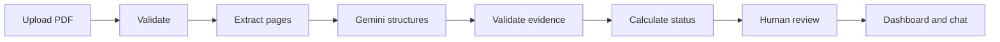
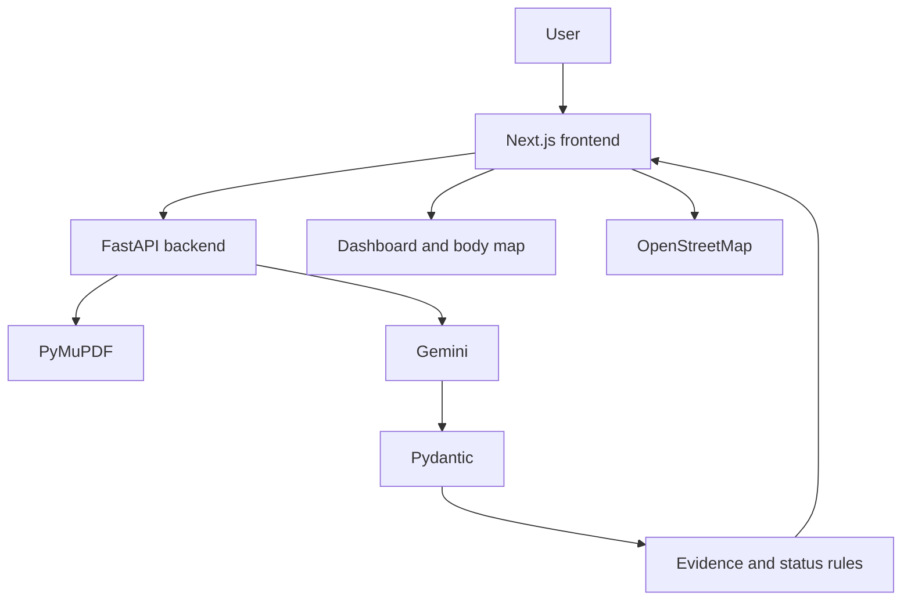

# Clarity Health: Interview Speaking Script

Speak naturally. Learn the flow instead of memorizing every word.

> Clarity Health is an educational AI prototype. It does not diagnose disease or recommend treatment.

# Part 1: Presentation

## Opening

**You:**
> Hi, thank you for the opportunity. I built an AI-assisted health-report prototype called Clarity Health.
> I will explain the problem using STAR, show the workflow, describe the architecture, and finish with limitations and future work.

## STAR Introduction

### Situation

**You:**
> The idea came from a personal situation. My parents recently received blood-test reports after a health checkup.
> They could see values such as hemoglobin, white blood cells, platelets, glucose, and creatinine, but they could not easily understand them.
> I had to research each marker manually, so I saw an opportunity for an AI prototype.

### Task

**You:**
> My task was to make laboratory reports easier for non-medical users to understand.
> The system should organize the report, preserve evidence, visualize confirmed values, and explain them in simple language.
> It should educate users, not diagnose disease or recommend treatment.

### Action

**You:**
> I built a controlled full-stack AI pipeline.
> The frontend uses Next.js, React, TypeScript, and Tailwind CSS.
> The backend uses Python, FastAPI, Pydantic, and PyMuPDF.
> Gemini handles structured extraction, questions, and translation.
> Three.js creates the body map, and Leaflet with OpenStreetMap provides nearby-care discovery.

**You:**
> PyMuPDF extracts page text. Gemini organizes it into a strict schema.
> The backend verifies evidence. Python calculates range status.
> The user confirms or excludes every result before the dashboard is created.

### Result

**You:**
> The result is a working end-to-end prototype.
> Users can upload a synthetic or de-identified PDF, review AI extraction, correct mistakes, and generate a dashboard from confirmed data only.
> Confirmed results power range charts, education, a 3D body map, multilingual chat, trusted references, and nearby care.

**You:**
> My main learning was that an AI product is not only a model call.
> The important engineering is validation, evidence, deterministic rules, human review, testing, cost, and user experience.

## What the Prototype Tests

**You:**
> I designed it around five questions.
> Can text-based PDFs be read reliably?
> Can an LLM organize irregular report text?
> Can hallucination risk be reduced and detected?
> Can confirmed values be shown more clearly?
> Can chat stay grounded in the confirmed report?

## Prototype Stage

**You:**
> The proof of concept was reading a PDF and receiving structured JSON.
> The prototype adds upload, review, visualization, education, and questions.
> An MVP would support defined report formats and be tested with real users.
> Production would require security, privacy, monitoring, clinical review, and regulatory analysis.

## Process Flow

### Spoken walkthrough

**You:**
> The browser checks the selected PDF for type and size.
> FastAPI repeats those checks because frontend validation can be bypassed.

> PyMuPDF reads every page separately and preserves page numbers.
> The user sees the raw extracted text before AI processing.

> Before Gemini receives text, the user confirms the report is synthetic or de-identified.

> Gemini receives page-marked text and a Pydantic schema.
> It extracts the test name, value, unit, range, flag, page, and source excerpt.
> Missing information remains null.

> Pydantic validates the response shape.
> The backend checks that each source excerpt exists on the claimed page.

> Python compares values with the printed range.
> Gemini does not perform this exact calculation.

> The user can edit, confirm, or exclude every result.
> Only confirmed results become dashboard data.

> The dashboard shows ranges, source evidence, education, the body map, languages, chat, and nearby care.

## Software Architecture

## Architecture Dialogue

**You:**
> Next.js handles everything the user sees and clicks.
> FastAPI is the trusted backend boundary and owns secrets and safety rules.
> PyMuPDF reads the report locally before AI is involved.
> Gemini handles language ambiguity.
> Pydantic validates runtime data and supplies Gemini's schema.
> Python verifies evidence and calculates range status.

## Technology Summary

**You:**
> Next.js provides pages, routing, development tools, and production builds.
> React updates the interface from state.
> TypeScript catches many contract mistakes before runtime.
> Tailwind helped me build a responsive interface quickly.

**You:**
> Python provides strong AI and document libraries.
> FastAPI creates typed API routes.
> Uvicorn runs the FastAPI server.
> PyMuPDF extracts selectable text page by page.
> Pydantic validates data and creates the Gemini schema.

**You:**
> Gemini structures irregular text, answers questions, and translates long content.
> It does not validate files, calculate status, confirm results, generate URLs, or find clinics.

**You:**
> Three.js creates the interactive educational body map.
> Leaflet renders the map, and OpenStreetMap provides nearby facilities.

## Reliability and Safety

**You:**
> I do not claim to eliminate hallucinations.
> I reduce and detect them with strict schemas, null handling, source pages, exact excerpt checks, deterministic calculations, human confirmation, citation validation, and trusted URLs.

**You:**
> Prompt instructions alone are not enough.
> The strongest controls happen after the model response.

**You:**
> The prototype uses synthetic or de-identified reports.
> Cloud processing requires confirmation.
> The API key stays on the backend.
> I do not claim HIPAA or GDPR compliance.

## Important Features

**You:**
> Human review is the most important safety feature.
> AI output cannot silently become dashboard truth.

**You:**
> The range chart shows the confirmed value and the laboratory's printed minimum and maximum.

**You:**
> The health rating is only a range-alignment experiment, not a clinical score.

**You:**
> The body map is educational, not diagnostic anatomy.
> It can highlight several related body regions at the same time.

**You:**
> Local educational content loads instantly and costs nothing.
> Gemini is called only for custom questions and detailed translation.

**You:**
> The report assistant receives confirmed results only.
> Its cited test names are checked by the backend.
> PubMed and MedlinePlus URLs are generated by code, not Gemini.

## Testing

**You:**
> Pytest checks backend rules and safety behavior.
> ESLint and the production build check the frontend.
> Browser automation checks the complete workflow, mobile layout, RTL, chat, maps, and 3D rendering.

**You:**
> The current baseline is 27 passing backend tests, clean lint, and a successful production build.

## Limitations

**You:**
> Native extraction is preferred. Image-only pages use a CPU Tesseract fallback and are marked for review.
> Extraction has not yet been evaluated across a large golden dataset.
> There is no authentication or persistent report history.
> Translations are not professionally medically reviewed.
> The body map is illustrative, and the health rating is not clinically validated.
> Nearby facility data may be incomplete.

## Future Work

**You:**
> My first next step is evaluation across diverse synthetic reports.
> I would measure field accuracy, result recall, invented results, source accuracy, latency, and cost.

**You:**
> Next, I would evaluate Tesseract accuracy across scanned reports and preserve whether each page came from native extraction or OCR.

**You:**
> Production work would include redaction, authentication, encryption, retention controls, rate limiting, monitoring, and professional clinical review.

## Five-Minute Demo Dialogue

**You:**
> I will start with a synthetic PDF. The browser and backend both validate it.

> PyMuPDF extracts page text and preserves page numbers.

> I confirm the report is safe for cloud processing. Gemini structures the data using a Pydantic schema.

> This review table is the human safety gate. I can edit, confirm, or exclude results.

> The dashboard now uses confirmed data only. It shows exact values, printed ranges, and evidence.

> Selecting Glucose highlights related body systems through deterministic mapping.

> Common explanations are local. Gemini is called only for custom questions or translation.

> The report assistant sees all confirmed results and returns validated citations.

> I can switch to Spanish, Arabic, or Telugu.

> Nearby care uses free map data and clearly discloses that ratings are unavailable.

> The next major phase is measured evaluation, followed by OCR.

---

# Part 2: Questions to Expect

## Product Questions

### Interviewer: Tell me about the project.
**You:** Clarity Health converts laboratory PDFs into reviewed dashboards using page extraction, structured Gemini output, evidence checks, deterministic rules, and visualization.

### Interviewer: Why did you build it?
**You:** My parents found laboratory reports difficult to understand. I wanted to test whether AI could organize the existing information without pretending to diagnose them.

### Interviewer: Who is the user?
**You:** A non-medical adult who wants to understand a routine report and prepare questions for a healthcare professional.

### Interviewer: What is the most important feature?
**You:** Human review. AI output cannot become dashboard data until the user confirms or excludes it.

### Interviewer: What did you leave out?
**You:** GPU-backed OCR, authentication, persistence, diagnosis, treatment advice, and production compliance claims.

## Architecture Questions

### Interviewer: Why Next.js and FastAPI?
**You:** Next.js helped me build a polished typed frontend quickly. FastAPI works naturally with Python's AI, PDF, validation, and testing libraries.

### Interviewer: Why separate frontend and backend?
**You:** The frontend handles interaction. The backend owns secrets, validation, AI calls, and safety enforcement.

### Interviewer: Why PyMuPDF?
**You:** It is fast, reads PDF bytes, preserves pages, and can render pages later for OCR.

### Interviewer: Why Pydantic?
**You:** It validates runtime data and creates the structured-output schema used by Gemini.

### Interviewer: Why no database?
**You:** It was not needed to test the core workflow and would add privacy, retention, and authentication responsibilities.

## AI Questions

### Interviewer: Why Gemini?
**You:** It supports structured output and multilingual responses. I isolated it behind backend services so it can be replaced.

### Interviewer: How do you reduce hallucinations?
**You:** Strict schemas, null handling, source evidence, excerpt verification, deterministic calculations, confirmed-only chat, citation checks, trusted URLs, and human review.

### Interviewer: Does valid JSON mean correct data?
**You:** No. It proves the structure, not the facts. Evidence checks, review, and evaluation are still needed.

### Interviewer: Why not let AI calculate status?
**You:** Numeric comparison is exact and testable in code. AI would add cost and variability.

### Interviewer: Why no RAG or autonomous agent?-> explain more about this question? i used autonomous agent in the chatbot integrated in the site
**You:** One small structured report fits directly in context, and the workflow is known. A controlled pipeline is simpler and safer.

### Interviewer: Is this only a Gemini wrapper?
**You:** No. Gemini is one component inside PDF processing, schemas, evidence checks, rules, review, visualization, maps, and tests.

## Safety Questions

### Interviewer: Is this a diagnosis system?
**You:** No. It is an educational prototype that explains confirmed report information.

### Interviewer: Is it HIPAA compliant?
**You:** I make no compliance claim. Production compliance requires technical, legal, contractual, and operational controls.

### Interviewer: What if Gemini is wrong?
**You:** Its output must pass schema and evidence checks and then human review. I would also measure accuracy with a golden dataset.

### Interviewer: Is the health rating medically valid?
**You:** No. It is a transparent range-alignment experiment. I would validate, rename, or remove it before production.

## Testing and Future Questions

### Interviewer: How did you test it?
**You:** Pytest for backend rules, lint and build for frontend quality, browser automation for workflows, and controlled real Gemini calls.

### Interviewer: How would you evaluate extraction?
**You:** Use synthetic reports with expected JSON and measure field accuracy, recall, invented results, source accuracy, latency, and cost.

### Interviewer: How would you add OCR?
**You:** Use native text first, OCR only empty pages, record provenance, and require review for OCR-derived fields.

### Interviewer: What would you improve first?
**You:** Evaluation across diverse report layouts, because reliability is the largest remaining uncertainty.

## Behavioral Questions

### Interviewer: Did you build it alone?
**You:** I owned the problem, scope, architecture, implementation, testing, and validation. I used AI tools for speed but verified the work through executable checks.

### Interviewer: What did you learn?
**You:** Treat model output as untrusted, keep exact rules deterministic, preserve evidence early, and test providers with mocks and real calls.

### Interviewer: What would you do differently?
**You:** I would create the golden evaluation dataset earlier, before expanding the feature set.

### Interviewer: Why should we hire you?
**You:** I can turn a real problem into a working full-stack AI prototype while thinking critically about reliability, safety, cost, and scope.

### Interviewer: Where do you need to grow?
**You:** I want deeper experience with formal LLM evaluation, observability, cloud deployment, and privacy architecture.

---

## Questions to Ask the Interviewer

**You:** How does your team decide when an AI prototype is reliable enough to become an MVP?

**You:** How do you evaluate model quality for unstructured documents?

**You:** Is this role focused more on product experiments, full-stack demos, or productionizing AI behavior?

**You:** What would excellent performance look like during the first three months?

## Final Closing

**You:**
> That is Clarity Health.
> It shows how I approach AI systems responsibly: start with a real problem, keep exact logic deterministic, constrain the model, preserve evidence, involve the user, test failures, and communicate limitations honestly.